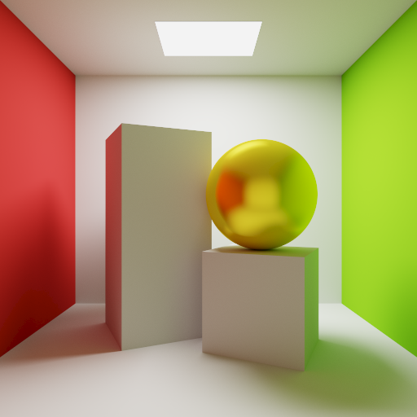

## Howdy! 👋

I'm Jonah, I'm an undergraduate student in Computer Engineering at Texas A&M, with interest areas in Computer Graphics and Game Development.

### Featured Project: Homemade Path Tracer

	
	 
	<a href="https://github.com/JonahT22/My-First-Path-Tracer">Check it out</a>

---

- 🌱 I’m currently learning how to use Machine Learning to de-noise images rendered from my homemade monte-carlo path tracer
- 💬 Ask me about Game Design, Unreal Engine, and movie fight scenes 🎬
- 📫 How to reach me: Send me a message on [LinkedIn!](https://www.linkedin.com/in/jonahbtaylor/)
- 😄 Pronouns: He/Him
- ⚡ Fun fact: I like marching band so much that I spent 5 summers touring across the USA in the DCI World Championships. ([It was completely worth it!](https://youtu.be/LCxm7BtWmSw?t=119))
